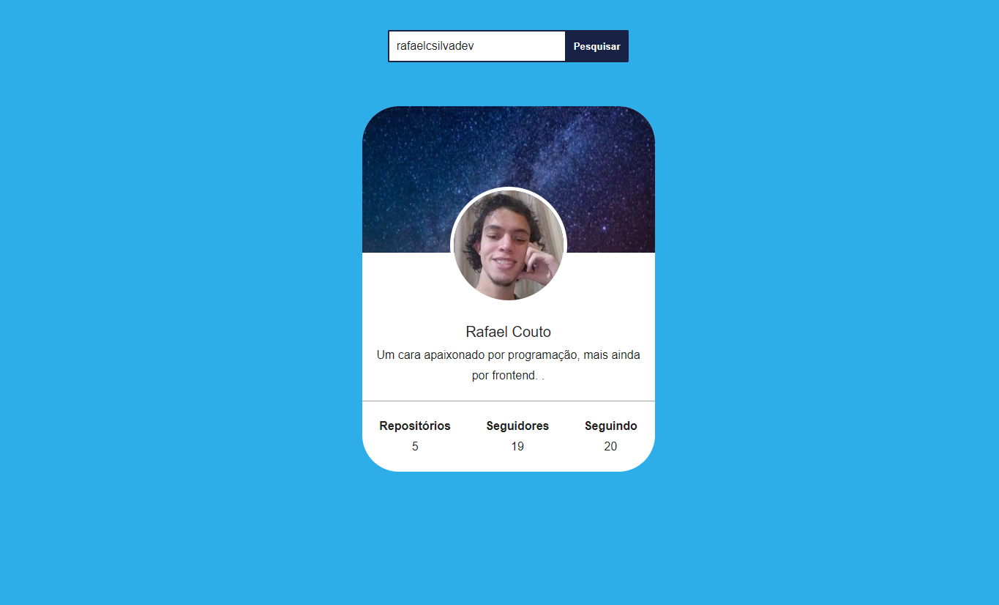

<h2>    
    Jogo da Velha
</h2>

    Profile Card

    

<h2 id='objective'>Objetivo</h2>

   Um site onde voce pode ver algumas informações de usuários do github. 

<h2 id='technologies'>
    Tecnologias
</h2>
<ul>
    <li>
        <a href="https://nextjs.org/">Next.js</a>
    </li>
    <li>
        <a href="https://sass-lang.com/">Sass</a>
    </li>
    <li>
        <a href="redux.js.org/">Redux</a>
    </li>
    <li>
        <a href="typescriptlang.org">TypeScript</a>
    </li>
</ul>

<h2>
    Link do projeto:
</h2>

    <a href="https://rafa-new-tic-tac-toe.herokuapp.com/">Profile Card</a>

